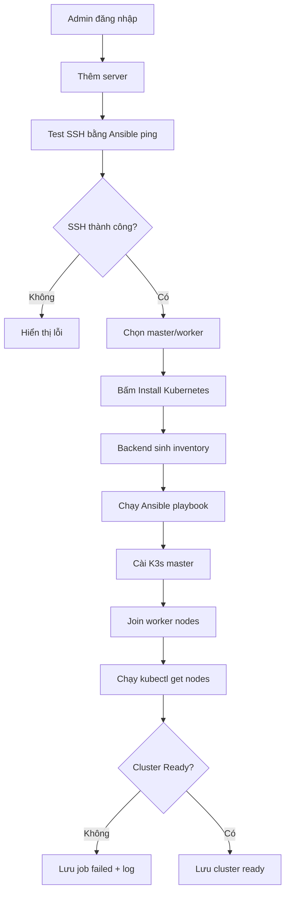
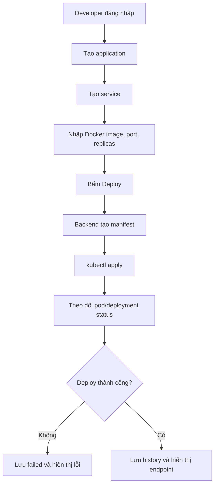

# Activity diagrams

## Cài Kubernetes bằng website

```mermaid
flowchart TD
    A[Admin đăng nhập] --> B[Thêm server]
    B --> C[Test SSH bằng Ansible ping]
    C --> D{SSH thành công?}
    D -- Không --> E[Hiển thị lỗi]
    D -- Có --> F[Chọn master/worker]
    F --> G[Bấm Install Kubernetes]
    G --> H[Backend sinh inventory]
    H --> I[Chạy Ansible playbook]
    I --> J[Cài K3s master]
    J --> K[Join worker nodes]
    K --> L[Chạy kubectl get nodes]
    L --> M{Cluster Ready?}
    M -- Không --> N[Lưu job failed + log]
    M -- Có --> O[Lưu cluster ready]
```

## Deploy service

```mermaid
flowchart TD
    A[Developer đăng nhập] --> B[Tạo application]
    B --> C[Tạo service]
    C --> D[Nhập Docker image, port, replicas]
    D --> E[Bấm Deploy]
    E --> F[Backend tạo manifest]
    F --> G[kubectl apply]
    G --> H[Theo dõi pod/deployment status]
    H --> I{Deploy thành công?}
    I -- Không --> J[Lưu failed và hiển thị lỗi]
    I -- Có --> K[Lưu history và hiển thị endpoint]
```
