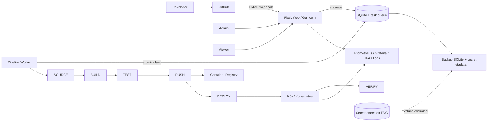

# Kiến trúc CICT Platform

## Tổng thể

## Ranh giới process và dữ liệu

- Gunicorn chạy đúng một web worker process theo topology SQLite hiện tại. Web
  xác thực, kiểm tra CSRF/RBAC, render UI và ghi pipeline ở trạng thái `Queued`.
- `python -m app.pipeline_worker` là process riêng. Worker dùng transaction
  `BEGIN IMMEDIATE` để claim duy nhất task cũ nhất rồi chạy
  `SOURCE → BUILD → TEST → PUSH → DEPLOY → VERIFY`.
- Web restart không đọc hoặc thay đổi queue. Khi worker mới khởi động, run còn
  `Running` được kết thúc ở trạng thái `Interrupted`; retry là thao tác có chủ
  ý, tạo run mới. Run `Queued` vẫn nguyên vẹn và được worker nhận.
- SQLite là nguồn dữ liệu chuẩn cho application, pipeline, stage, deployment,
  job, audit và webhook delivery. JSON cũ chỉ phục vụ migration/tương thích.
- SQLite, application secret store, registry credential store và webhook secret
  store nằm trên cùng PVC `/var/lib/platform`.

## Giới hạn đồng thời

`reserve_pipeline_run` khóa ghi SQLite để giữ một active pipeline trên mỗi
application và `PIPELINE_MAX_CONCURRENT` trên toàn Platform. Manifest production
đặt giới hạn bằng `1`. Không chạy nhiều worker hoặc nhiều replica web khi còn
dùng SQLite; hướng phát triển là PostgreSQL + Redis/Celery hoặc queue managed.

## Runtime production

Một Pod `Recreate`, một PVC `ReadWriteOnce`, hai container:

1. `platform`: Gunicorn, `/healthz`, `/readyz`.
2. `pipeline-worker`: worker SQLite, Docker CLI qua SSH tới build worker và
   `kubectl` qua ServiceAccount.

Cả hai chạy UID/GID 10001, non-root, seccomp `RuntimeDefault`, drop toàn bộ
capability và có resource requests/limits. Pod có 60 giây graceful termination.

`/healthz` chỉ chứng minh web process sống. `/readyz` kiểm tra SQLAlchemy DB,
delivery DB, thư mục dữ liệu ghi được và cấu hình production thiết yếu.

## Luồng bảo mật

- Form nội bộ dùng CSRF token; webhook GitHub là ngoại lệ duy nhất và bắt buộc
  `X-Hub-Signature-256` HMAC SHA-256.
- Application/deployment/log/pipeline đều được kiểm tra scope application.
- Secret value không nằm trong application, deployment, job hay audit payload.
  Manifest preview và log được mask trước khi trả về/lưu.
- Cookie có `HttpOnly`, `SameSite=Lax`; production từ chối khởi động nếu
  `COOKIE_SECURE` không bật.

## Khả năng phục hồi

Backup dùng SQLite online backup API và `PRAGMA integrity_check`. Archive chỉ
có DB, manifest và metadata reference/key của secret. Plaintext credential
không được sao chép. Sau restore phải nạp lại secret value từ Kubernetes Secret,
password manager hoặc Vault rồi restart Pod.
