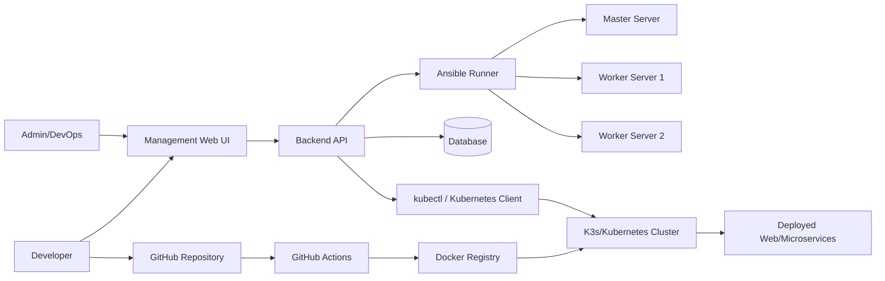

# Kiến trúc CICT Platform

Management server chạy Web UI, Backend, database demo, Ansible và kubectl. Server này điều khiển các máy target bằng SSH/Ansible để cài K3s, sau đó dùng Kubernetes API/kubectl để deploy ứng dụng.
