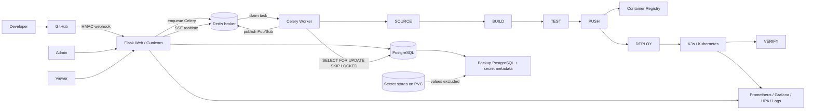

# Kiến trúc CICT Platform

## Tổng thể

## Ranh giới process và dữ liệu

- **PostgreSQL** (`DATABASE_URL`) là nguồn dữ liệu chuẩn cho application, pipeline,
  stage, deployment, job, audit, webhook delivery và users. **SQLite** vẫn là
  backend fallback cho dev/test (khi truyền `path=` tường minh hoặc chưa đặt
  `DATABASE_URL`); JSON cũ chỉ phục vụ migration/tương thích.
- Web xác thực, kiểm tra CSRF/RBAC, render UI và ghi pipeline ở trạng thái
  `Queued` (qua `reserve_pipeline_run` dùng `pg_advisory_xact_lock`).
- **Celery Worker** (`celery -A app.worker.celery_app worker`) là process riêng,
  nhận task qua **Redis broker**, chạy `SOURCE → BUILD → TEST → PUSH → DEPLOY → VERIFY`.
  Tiến trình được publish realtime qua Redis Pub/Sub → SSE.
- Web restart không đổi queue. Khi worker khởi động, run còn `Running` được kết
  thúc ở trạng thái `Interrupted`; retry là thao tác có chủ ý, tạo run mới.
- Application secret store, registry credential store và webhook secret store nằm
  trên cùng PVC `/var/lib/platform`.

## Giới hạn đồng thời

`reserve_pipeline_run` giữ một active pipeline trên mỗi application và
`PIPELINE_MAX_CONCURRENT` trên toàn Platform. Với SQLite (dev/test), giới hạn này
được ép bằng `BEGIN IMMEDIATE` và chỉ chạy được 1 worker/1 web replica. Với
PostgreSQL (`DATABASE_URL`), giới hạn dùng `pg_advisory_xact_lock`, queue chạy
qua **Celery + Redis** nên có thể mở nhiều worker (`--concurrency`) và nhiều web
replica. Tiến trình deploy được đẩy realtime qua Redis Pub/Sub + SSE
(`/api/v1/pipeline/<id>/events`).

## Runtime production

Một Pod `Recreate`, một PVC `ReadWriteOnce`, hai container:

1. `platform`: Gunicorn, `/healthz`, `/readyz`.
2. `pipeline-worker`: Celery worker (Redis broker, PostgreSQL backend), Docker CLI
   qua SSH tới build worker và `kubectl` qua ServiceAccount.

Cả hai chạy UID/GID 10001, non-root, seccomp `RuntimeDefault`, drop toàn bộ
capability và có resource requests/limits. Pod có 60 giây graceful termination.

`/healthz` chỉ chứng minh web process sống. `/readyz` kiểm tra SQLAlchemy DB,
delivery DB, thư mục dữ liệu ghi được và cấu hình production thiết yếu.

## Luồng bảo mật

- Form nội bộ dùng CSRF token; webhook GitHub là ngoại lệ duy nhất và bắt buộc
  `X-Hub-Signature-256` HMAC SHA-256.
- Application/deployment/log/pipeline đều được kiểm tra scope application.
- Secret value không nằm trong application, deployment, job hay audit payload.
  Manifest preview và log được mask trước khi trả về/lưu.
- Cookie có `HttpOnly`, `SameSite=Lax`; production từ chối khởi động nếu
  `COOKIE_SECURE` không bật.

## Khả năng phục hồi

Backup dùng SQLite online backup API và `PRAGMA integrity_check`. Archive chỉ
có DB, manifest và metadata reference/key của secret. Plaintext credential
không được sao chép. Sau restore phải nạp lại secret value từ Kubernetes Secret,
password manager hoặc Vault rồi restart Pod.
