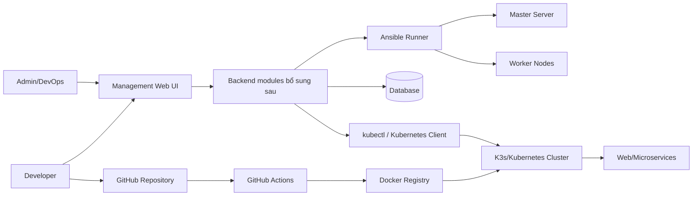

# Kiến trúc CICT Platform

Bản hiện tại chỉ code phần Web UI để trình bày trải nghiệm người dùng. Các khối Backend, Database, Ansible Runner và Kubernetes Client đã được định vị trong cấu trúc source nhưng chưa triển khai logic.
