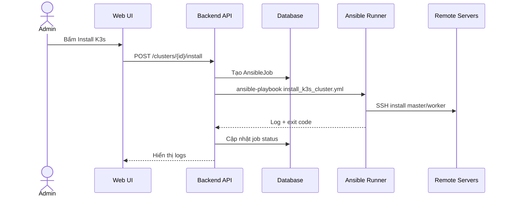
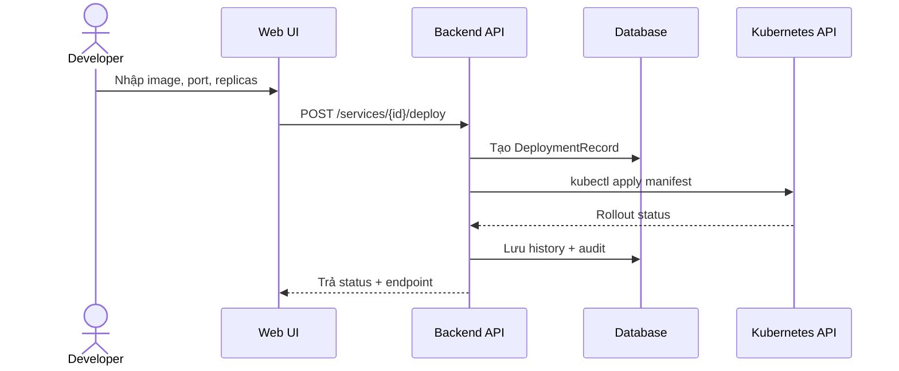

# Sequence diagrams

## Install cluster

```mermaid
sequenceDiagram
    actor Admin
    participant UI as Web UI
    participant API as Backend API
    participant DB as Database
    participant Ansible as Ansible Runner
    participant Node as Remote Servers

    Admin->>UI: Bấm Install K3s
    UI->>API: POST /clusters/{id}/install
    API->>DB: Tạo AnsibleJob
    API->>Ansible: ansible-playbook install_k3s_cluster.yml
    Ansible->>Node: SSH install master/worker
    Ansible-->>API: Log + exit code
    API->>DB: Cập nhật job status
    API-->>UI: Hiển thị logs
```

## Deploy service

```mermaid
sequenceDiagram
    actor Dev as Developer
    participant UI as Web UI
    participant API as Backend API
    participant DB as Database
    participant K8S as Kubernetes API

    Dev->>UI: Nhập image, port, replicas
    UI->>API: POST /services/{id}/deploy
    API->>DB: Tạo DeploymentRecord
    API->>K8S: kubectl apply manifest
    K8S-->>API: Rollout status
    API->>DB: Lưu history + audit
    API-->>UI: Trả status + endpoint
```
