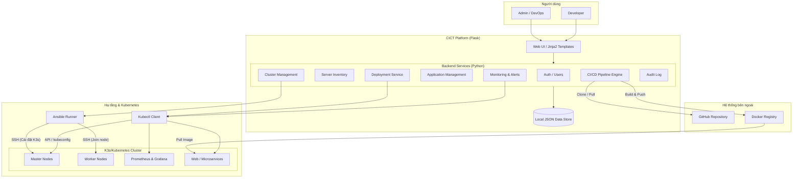
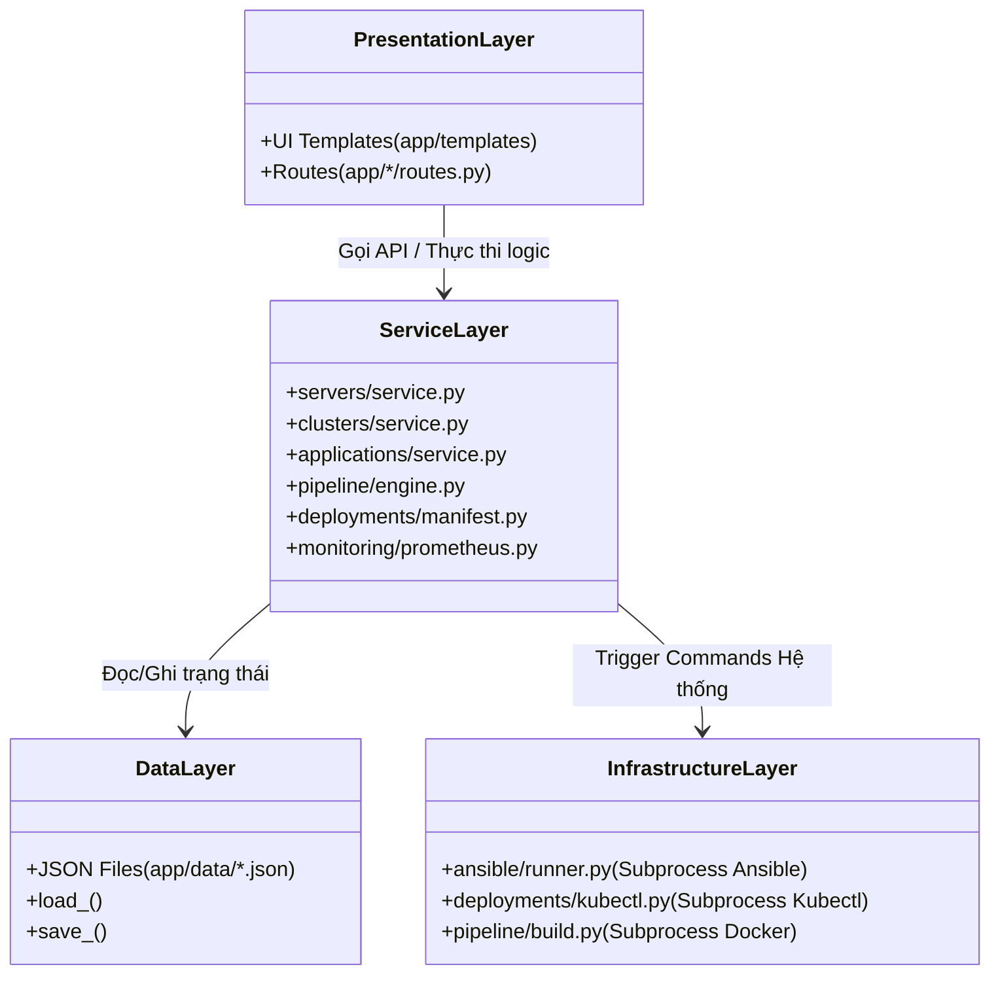
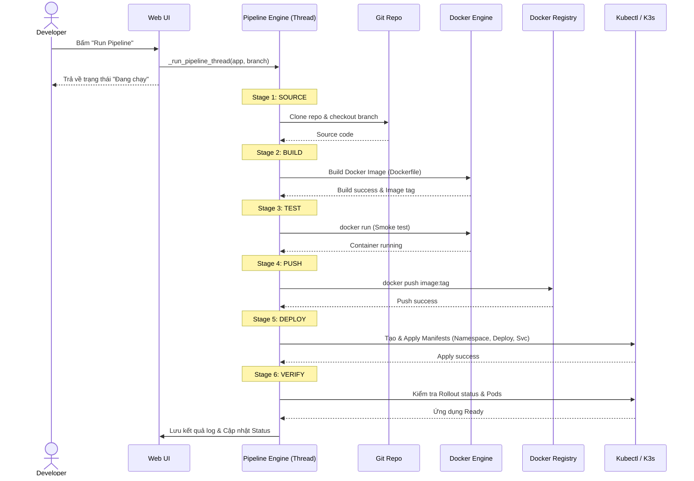
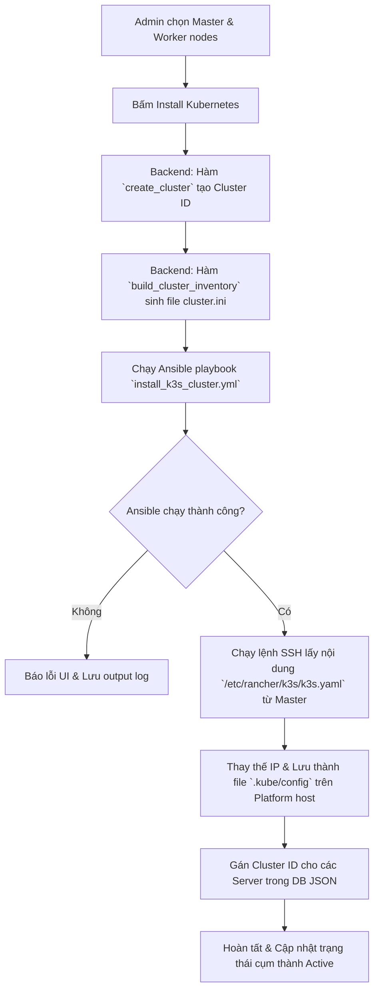

# Cập nhật Sơ đồ Kiến trúc và Luồng xử lý theo Thực tế Triển khai (CICT Platform)

Qua quá trình phân tích tài liệu thiết kế (trong thư mục `LVdocs/` và `docs/`) và đối chiếu với mã nguồn thực tế của dự án, có thể thấy dự án đã phát triển và hoàn thiện hơn rất nhiều so với bản thiết kế ban đầu. 

Đặc biệt, hệ thống đã triển khai đầy đủ Backend (bằng Python Flask), tự xây dựng CI/CD Pipeline nội bộ (không cần phụ thuộc vào GitHub Actions như bản nháp), và các module quản lý Cluster, Deployment đều đã được lập trình thực thi bằng code thông qua Ansible và Kubectl.

Dưới đây là các sơ đồ (Mermaid) được vẽ lại để phản ánh chính xác cấu trúc và logic code hiện hành của dự án.

## 1. Kiến trúc Hệ thống Tổng thể (System Architecture)

- **Ban đầu (Theo docs):** Thiết kế mô tả Backend sẽ bổ sung sau, dùng GitHub Actions cho CI/CD.
- **Thực tế:** Backend đã được phát triển hoàn chỉnh. Dùng Local JSON storage (thay cho Database SQL truyền thống). CI/CD Pipeline được code trực tiếp trong hệ thống (`app/modules/pipeline/engine.py`) thực hiện Pull code từ Github, Build Docker bằng command, Push lên Registry và gọi Deploy.



## 2. Thiết kế Module (Module Architecture)

Sơ đồ Class/Module này phản ánh cấu trúc thư mục code thực tế của nền tảng (theo mô hình MVC mở rộng).



## 3. Luồng thực thi CI/CD Pipeline (Sequence Diagram)

Hệ thống có Pipeline Engine (`engine.py`) chạy ngầm bằng `threading.Thread` đi qua 6 bước (Stages): SOURCE, BUILD, TEST, PUSH, DEPLOY, VERIFY.



## 4. Luồng Cài đặt Kubernetes Cluster (Activity Diagram)

Mô phỏng lại luồng chạy thực thi trong file `clusters/service.py` bằng Ansible.



## 5. Luồng Deploy Ứng dụng thủ công (Activity Diagram)

Mô phỏng quá trình `deploy_application` trong `deployments/kubectl.py` và `manifest.py`.

```mermaid
flowchart TD
    A[Người dùng cấu hình Application] --> B[Khai báo Image, Replicas, Ports, Env variables]
    B --> C[Bấm Deploy]
    C --> D[Backend: Sinh Namespace YAML]
    D --> E[Backend: Sinh Secret/ConfigMap YAML (nếu có Env/Config)]
    E --> F[Backend: Sinh Deployment YAML]
    F --> G[Backend: Sinh Service YAML (NodePort/ClusterIP) & Ingress]
    G --> H[Chạy subprocess `kubectl apply -f` từng manifest]
    H --> I{kubectl apply thành công?}
    I -- Không --> J[Lưu log lỗi vào DB & Đánh dấu Failed]
    I -- Có --> K[Chờ Pods khởi chạy & Rollout]
    K --> L[Ghi nhận Activity/Audit Log "Deployed"]
    L --> M[Cập nhật trạng thái ứng dụng thành Active]
```
